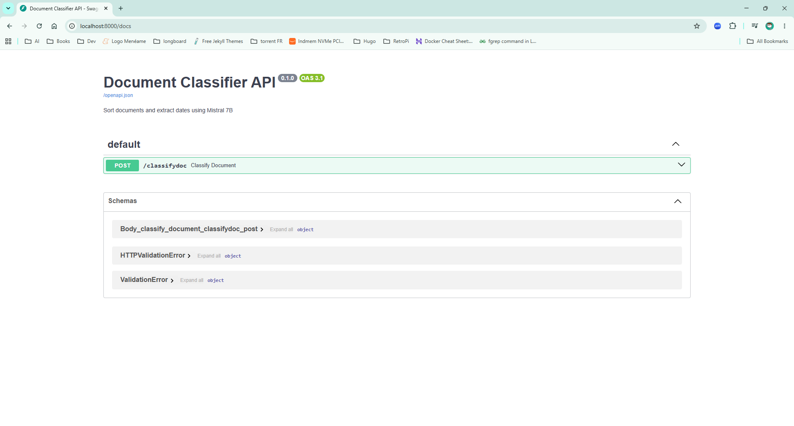

# ClassifyDocs

A Docker container that exposes a REST API to classify a document using a large language model (LLM) into a set of predefined categories:

 - Acuerdo marco
 - Adjudicación de licitación
 - Albaran / Nota de entrega
 - Contrato
 - Factura
 - Pedido
 - Pliego
 - Quotation / oferta

## Construction and implementation

The solution use [Docker](https://www.docker.com/) to share, and run a container applications.
```shell
# Build image
docker compose build

# Resume service
docker compose up -d

# See logs (optional)
docker compose logs -f classifier
```

### Regenerate the container 

```shell
# Stops containers and removes containers, networks, volumes, and images created by up .
docker compose down -v   

docker compose build
docker compose up -d
docker compose logs -f classifier
```

## REST API exposed

 - Base URL: http://localhost:9191
 - Methods:
   - **[POST]** `/classifier/v1/classify`: Classify a document using a large language model (LLM) into a set of predefined categories
     - Body params:
       - file: Path to the file to be cla

> **DISCLAIMER**: This API has been developed as a proof of concept. It doesn't include any authentication/security measure.
> So, it's not suitable for a production environment. It should be used as an example or for illustrative purposes.

## Swagger documentation

Swagger documentation is available on this URL [http://localhost:9191/docs](http://localhost:9191/docs), 
when the container is up. 



## Test the REST API from the command line

```shell
#  Example using curl 
curl -X POST "http://localhost:9191/classifier/v1/classify" -F "file=@/path/to/your/document.pdf"
```

# Application Architecture: Document Classifier API

This application provides a RESTful API for classifying documents and extracting relevant information (like dates) using a Large Language Model (LLM). The core components and their interactions are described below.

## 1. FastAPI Application

The application is built using **FastAPI**, a modern, fast (high-performance) web framework for building APIs with Python 3.7+ based on standard Python type hints.

*   **Main Entry Point**: `app/main.py` defines the FastAPI application instance.
*   **Endpoint**: A single `POST` endpoint is exposed: `/classifier/v1/classify`.
    *   It accepts a document file (`UploadFile`) as input.
    *   It returns a JSON object containing the classified category, extracted document date, and the original filename.
*   **Error Handling**: Includes robust error handling for file processing issues, text extraction failures, and general classification errors, returning appropriate HTTP status codes.
*   **Swagger UI**: FastAPI automatically generates interactive API documentation (Swagger UI) accessible at `/docs` when the application is running.

## 2. Document Processing Flow

The classification process follows these steps:

1.  **File Upload**: A client sends a document file (e.g., PDF, image, text file) to the `/classifier/v1/classify` endpoint.
2.  **Temporary Storage**: The uploaded file is temporarily saved to the local filesystem. This is necessary for `extract_text_from_file` to access the file content.
3.  **Text Extraction**: The `extract_text_from_file` utility (located in `app/utils.py`) reads the temporary file and extracts its textual content. This utility is designed to handle various document types (e.g., PDF, images via OCR, plain text).
4.  **Content Validation**: After extraction, the text is validated to ensure sufficient content was retrieved. If not, a `400 Bad Request` error is returned.
5.  **LLM Classification**: The extracted text is then passed to the `classify_text` function (also in `app/utils.py`). This function interacts with an LLM to:
    *   Determine the document's category from a predefined list (`CATEGORIES`).
    *   Extract a significant date from the document's content.
6.  **Response Generation**: The results from the LLM (category and date) are combined with the original filename and returned as a JSON response to the client.
7.  **Cleanup**: The temporary file is deleted from the filesystem to prevent accumulation of temporary data.

## 3. Utility Functions (`app/utils.py`)

The `app/utils.py` module encapsulates the core logic for text extraction and LLM interaction:

*   **`extract_text_from_file(file_path)`**:
    *   Responsible for reading different document formats (e.g., PDF, images, plain text) and converting their content into a unified text string.
    *   Likely uses libraries like `PyPDF2`, `Pillow` (for images), and potentially OCR tools (e.g., `Tesseract`) for image-based documents.
*   **`classify_text(text, categories)`**:
    *   This is the interface to the Large Language Model.
    *   It sends the extracted `text` and the list of `categories` to the LLM.
    *   The error message `BaseModel.model_validate_json() missing 1 required positional argument: 'json_data'` suggests that this function is expecting the LLM's response to be a JSON string that can be parsed into a Pydantic `BaseModel` (or similar validation model), but it's not receiving the expected `json_data` argument, or the LLM's output isn't in the expected JSON format for direct validation.
    *   It uses **Ollama** as the runtime for the LLM, which implies local deployment or access to an Ollama server.

## 4. LLM Integration (Ollama & Mistral 7B)

*   **Ollama**: Serves as the local LLM inference server. It allows running large language models like Mistral 7B locally.
*   ~~**Mistral 7B**: The specific Large Language Model used for classification and date extraction. It's chosen for its balance of performance and efficiency.~~
*   **gemma4:e2b**: The specific Large Language Model used for classification and date extraction. It's chosen for its balance of performance and efficiency. 

## Architecture Diagram (Conceptual)

```text
## Architecture Diagram (Conceptual)

+-------------------+       +------------------------+       +---------------------+
|   Client (User)   |------>|   FastAPI Application  |------>|   app/utils.py      |
+-------------------+       |     (main.py)          |       |                     |
                            |                        |       | - extract_text_from_file()
                            | - POST /classifier/v1/classify | - classify_text()
                            | - File Upload Handling |       +----------+----------+
                            +----------+-------------+                  |
                                       |                                |
                                       | (Extracted Text & Categories)  |
                                       V                                V
                            +----------+-------------+       +----------+----------+
                            | Temporary File Storage |       |   Ollama Server     |
                            |    (for uploaded file) |<------>|   (gemma4:e2b)     |
                            +------------------------+       +---------------------+
                                       ^
                                       |
                                       | (Cleanup)
                                       |
```

This architecture provides a scalable and modular approach to document classification, 
leveraging FastAPI for API development and an LLM for intelligent content analysis.